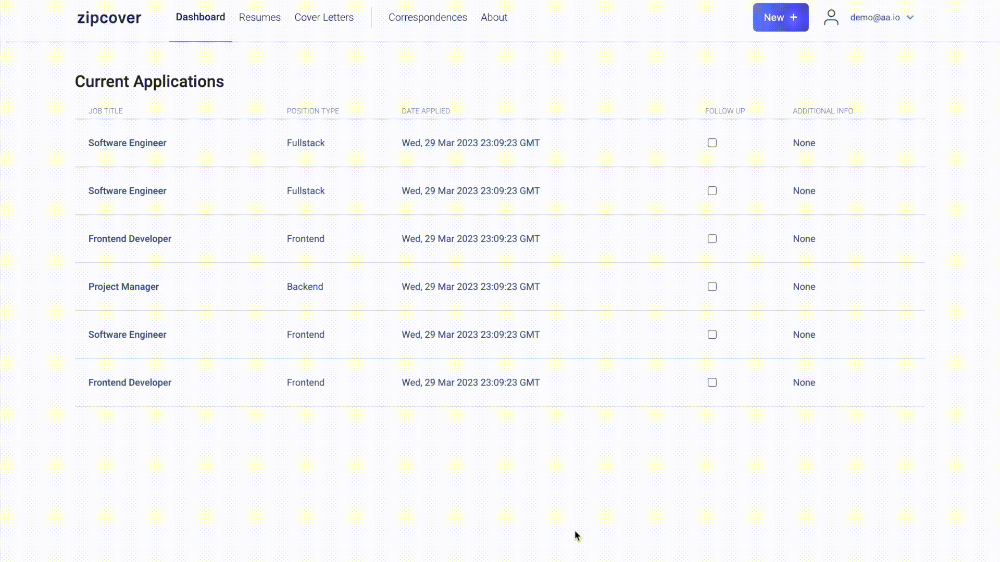
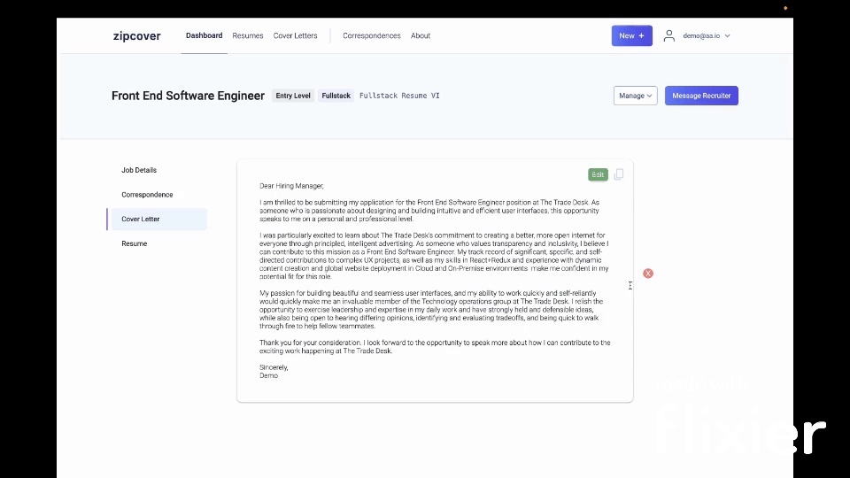

# ZipCover
ZipCover is a tool designed to simplify the process of writing and editing cover letters for job applications. Whether you're a junior web developer looking for your first job or an experienced professional seeking a new challenge, ZipCover is the perfect tool for you.

[](https://skillicons.dev)

## Live Site
https://zipcover.onrender.com

## Features
- Generate cover letters from scratch based on your resume and job descriptions
- Edit existing cover letters to make them more personalized and impactful
- Track job applications and generate automatic correspondences with recruiters

### Create a Cover Letter


### Correspond with Recruiters & Network


## How it Works
ZipCover makes use of the advanced language generation capabilities of GPT-3 to generate cover letters that are both relatable and tailored to your specific needs. All you need to do is provide your resume and a job description, and ZipCover will take care of the rest.

If you already have a cover letter that you'd like to improve, ZipCover can help you add an additional paragraph that explains why you're interested in working for a particular company. Simply provide the cover letter and additional details about the company, and ZipCover will generate a personalized and impactful addition to your existing letter.

## Why Use ZipCover
Writing and editing cover letters can be a time-consuming and stressful process, especially if you're not sure what to include or how to make your letter stand out from the crowd. With ZipCover, you can get your cover letters done quickly and easily, giving you more time to focus on other important aspects of your job search.

So if you're ready to take your cover letter game to the next level, give ZipCover a try today!

## Tech Stack
ZipCover has been built using the following technologies:

- Python
- Flask
- PostgreSQL
- React.js
- Redux
- Javascript
- CSS

## Database Schema Design

![zipcover-dbschema]

[zipcover-dbschema]: ./app/assets/zipcover-schema.png

## Prerequisites
Before you can start using ZipCover, you will need to set up the following environment variables using a .env file:

```
DATABASE_URL
FLASK_APP
FLASK_ENV
JWT_EXPIRES_IN
JWT_SECRET
NODE_ENV (e.g. production or development)
SCHEMA (for database configuration, e.g. 'zipcover_data')
OPENAI_API_KEY (found under your OpenAI account)
REACT_APP_BASE_URL (e.g. zipcover.onrender.com)
```
## **Build**
To install and build the front and backend, run the following command:
```bash
npm install --prefix react-app && npm run build --prefix react-app && pip install -r requirements.txt && pip install psycopg2 && flask db upgrade && flask seed all
```
The API comes seeded with 3 demo users for testing purposes. The build command will migrate the Users table and seed it with these 3 users.
## **Start**
To start the application, run the following command:
```bash
gunicorn app:app
```
